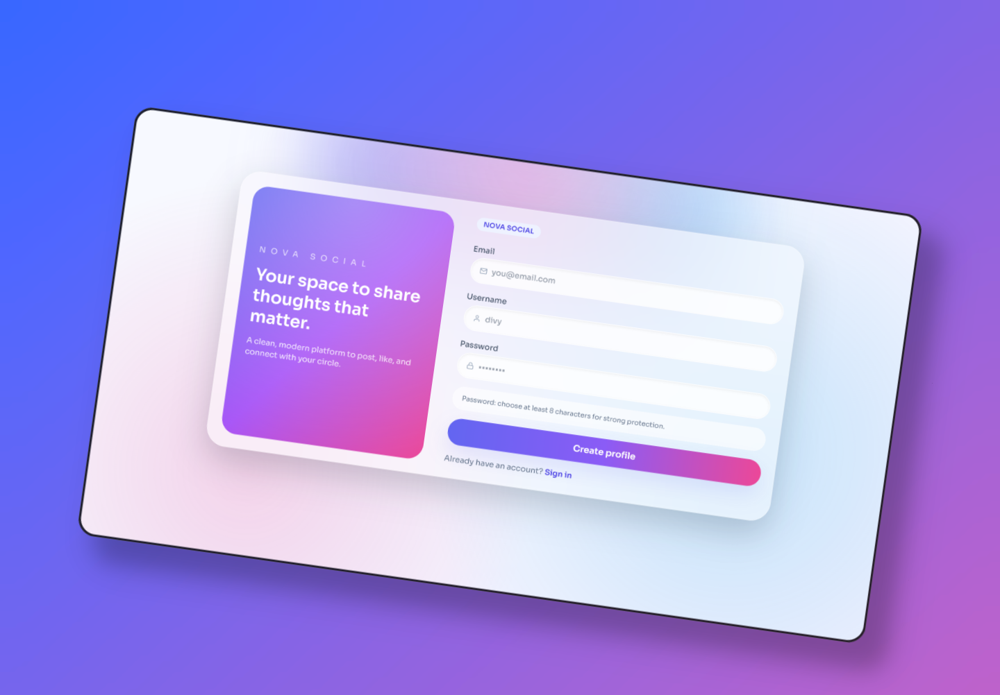
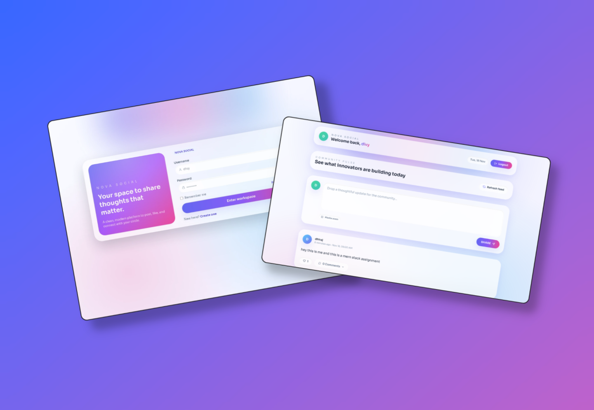

# Nova Social – MERN Stack Task 2

Premium social app built for the internship selection round. The project includes a full REST API layer (Express + MongoDB) and a Vite React frontend with glassmorphic UI, animations, and micro-interactions.

## 🚀 Deployment

- **Backend**: Hosted on [Render](https://render.com)
- **Frontend**: Hosted on [Vercel](https://vercel.com)

## 📸 Screenshots

### Login and Feed Page


### Signup Page


## Features Checklist

### APIs
- ✅ User registration (`POST /api/auth/signup`)
- ✅ User login (`POST /api/auth/login`)
- ✅ Forgot/reset password (`POST /api/auth/forgot-password`)
- ✅ CRUD for posts (`GET/POST/PUT/DELETE /api/posts`)
- ✅ Like/unlike posts (`POST /api/posts/:id/like`)
- ✅ Add comments (`POST /api/posts/:id/comment`)

### Frontend
- ✅ Signup, login, forgot-password flows with toasts + validation
- ✅ Protected feed with create/edit/delete posts
- ✅ Animated likes and expandable comment threads
- ✅ Skeleton loaders, avatars, floating action button, and responsive layout

## Prerequisites
- Node.js 18+
- npm 10+
- MongoDB connection string in `backend/.env` (`MONGODB_URI=...`)

## Setup & Run

```bash
# Backend
cd backend
npm install
npm run dev

# Frontend
cd ../frontend
npm install
npm run dev
```

- Backend defaults to `http://localhost:7777`
- Frontend (Vite) runs on `http://localhost:5173`
- If you need a different API host, change `frontend/src/api/axios.js`.

## Scripts

| Location  | Script         | Description                    |
|-----------|----------------|--------------------------------|
| backend   | `npm run dev`  | Nodemon dev server             |
| backend   | `npm start`    | Production server              |
| frontend  | `npm run dev`  | Vite dev server with HMR       |
| frontend  | `npm run build`| Production build               |
| frontend  | `npm run preview` | Preview production build   |
| frontend  | `npm run lint` | ESLint check                   |

## Tech Highlights
- Express, MongoDB, JWT/cookies for auth
- React 19 + Vite 7 + React Router
- Tailwind CSS 3.4 with custom mesh gradients + glass effects
- Framer Motion animations, React Toastify notifications
- Day.js for date formatting, React Icons for consistent iconography

## Demo Video Tips
1. Signup → auto-login
2. Logout + login again
3. Forgot password workflow
4. Post create/edit/delete
5. Like + comment interactions

Show browser DevTools network tab while hitting APIs to prove compliance. Good luck with the selection! 🚀
